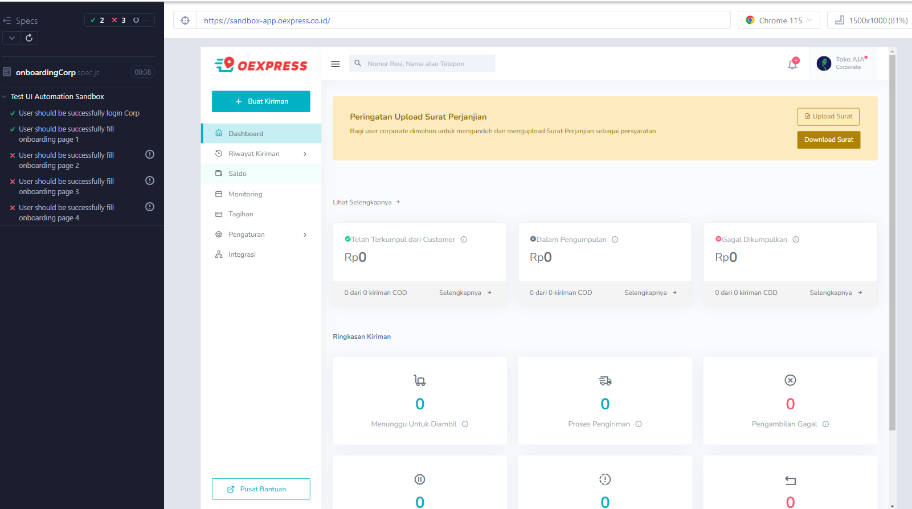

## HOW TO RUN
```bash 
1. npm init
2. npm install
3. npm install cypress --save-dev
4. npx cypress run or npm cypress open
5. npm install faker --save-dev
6. npm install cypress-file-upload --save-dev
```
## how to get result using mochawesome
```bash 
npm install --save-dev mochawesome
npm install --save-dev mocha@5.2.0
npm cypress run --reporter mochawesome
you can see the result at folder mochawesome-report
```

## link Test Case
https://docs.google.com/spreadsheets/d/1yo-c5LnGPlt32uAAT2mpnmD3nW6gF3j6fM65zrguS4Q/edit?usp=sharing

## Result
1. Register Regular 

2. Register Corp

3. Login

4. Forgot Password

5. Onboarding regular

6. Onboarding corp


## note
please change email for on boarding corp and regular for tetsing because i using dummy email which can only be used once on testdatacorp.json and testdataReg.json "emailForOnboarding"
